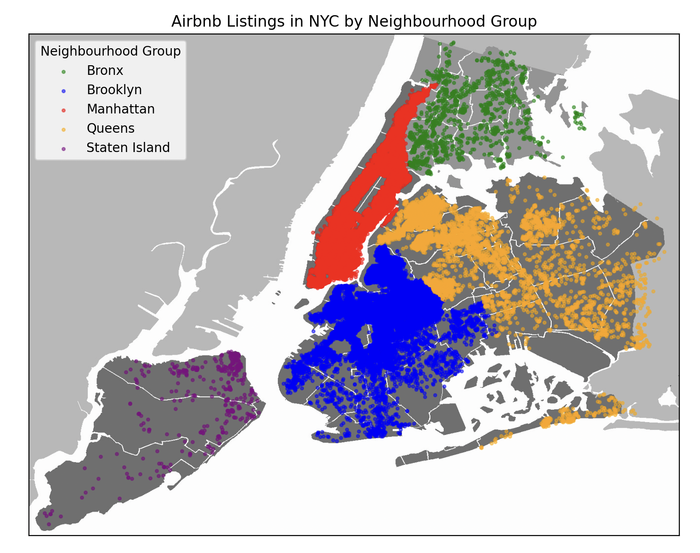
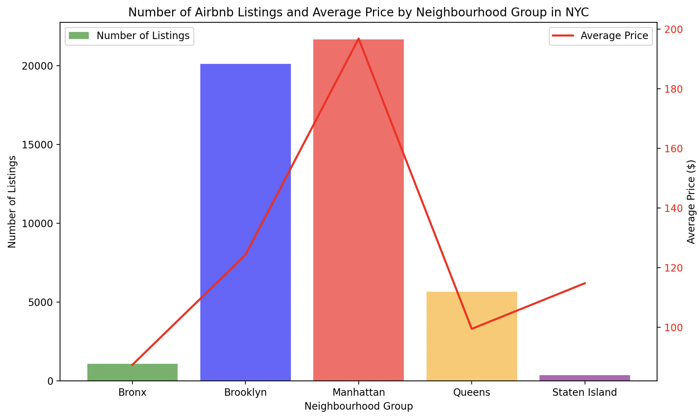

# neighbourhood_group 별 데이터 시각화
- neighbourhood_group 별 데이터를 시각화했습니다.

## 개요
- 1. neighbourhood_group별 숙소 위치를 파악
- 2. neighbourhood_group별 숙소 개수 및 평균 가격 파악

## neighbourhood_group별 숙소 위치 파악

### 시각화를 통해서 알 수 있는 점
1. Manhattan과 Brooklyn, Queens에 숙소가 가장 밀집한 것을 알 수 있습니다.
2. 또한 Queens는 상대적으로 넓은 분포에 숙소가 퍼져있는 것을 확인할 수 있습니다. 따라서 Queens는 따로 지역에 따른 숙소의 인기를 나눠서 확인하면 좋을 것 같습니다.
3. 마지막으로 Bronx와 Staten Island는 인기가 적은 것을 알 수 있습니다.

## neighbourhood_group별 숙소 개수 및 평균 가격 파악

### 시각화를 통해서 알 수 있는 점
1. Manhattan 지역이 가장 인기가 많고 그만큼 가격도 비싼 것을 알 수 있습니다.
2. Brooklyn은 두 번째로 많은 숙소를 가지고 있지만, Manhattan에 비해서는 상대적으로 저렴한 평균 가격을 가지고 있습니다.
3. 의외로 Staten Island는 숙소 개수가 적지만, 평균 가격은 3위를 차지하고 있습니다.

## 결론
- New York City에서 가장 숙소가 많은 곳은 Manhattan과 Brooklyn이다. 즉, 수요가 있기 때문에 그만큼 공급을 제공하는 것이고 이는 인기와도 연결이 된다고 할 수 있다.
- 또한 특정 지역에 밀집해 있기 때문에, 밀집지역과 아닌 지역의 가격 및 인기를 비교하면 좋을 것 같다.