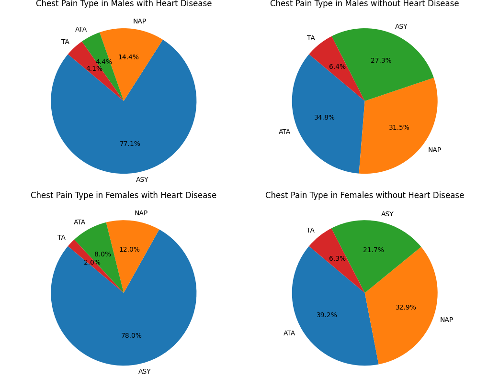

# 성별에 따른 데이터 분석 및 시각화
기본적인 데이터를 분석했을 때 성별에 따른 심장질병 여부가 차이가 있었기 때문에 자세히 분석했습니다.

## 기본 데이터 분석

심장질환이 있는 남성, 없는 남성, 평균 여성의 RestingBP 평균, Cholesterol 평균, FastingBS 평균, MaxHR 평균을 시각화했습니다.
- RestingBP와 Cholesterol, MaxHR의 경우에는 심장질환이 있는 남성과 없는 남성, 여성의 차이가 크게 나타나지 않습니다.
- 그러나 FastingBS, 즉 공복 혈당에서 큰 차이가 나타났습니다. 심장질환이 있는 남성이 없는 남성보다 2배 이상 높은 수치를 기록했고, 평균 여성보다도 1.5배 정도의 많은 수치가 나타났습니다.
- 이를 통해서 심장질환은 공복 혈당과 인과관계가 있다는 점을 도출했습니다.

## 가슴통증 유형에 따른 심장질환 분석

성별별 심장질환 여부에 따른 ChestPainType 분석입니다.
- 성별 관계 없이 공통적으로 나타난 사실은, 심장질환을 앓고 있는 사람의 대부분. 약 77% 이상은 ASY, 통증이 없다고 밝혔습니다.
- 그러나 앓고 있지 않은 사람은 반대로 약 24%만이 통증이 없다고 했으며 나머지 약 75% 이상이 통증이 있음을 얘기했습니다.
- 이를 통해서 2가지 결론을 도출할 수 있습니다.  
(1) 통증은 주관적으로 느끼는 정도가 다를 수 있기 때문에, 이런 결과가 나올 수 있다.  
(2) 심장질환을 갖고 있으면 통증에 무감각해지거나 인식이 안될 수 있다.  
라는 결론을 내릴 수 있습니다.

## 휴식 시 심전도 결과에 따른 심장질환 분석

성별별 심장질환 여부에 따른 RestingECG 분석입니다.
- 심장질환을 갖고 있는 사람의 경우, 약 42%가 휴식 시 심전도 결과에 문제가 있습니다. 남성의 경우는 ST, 여성의 경우는 LVH 이상이 나타났습니다.
- 또한 심장질환을 겪고 있지 않더라도 크게 차이가 나타나지 않습니다. RestingECG는 심장질환 여부에 관계 없이 나이에 따라 다르게 나타날 경향이 큽니다.

## 성별과 질환 유무, 에 따른 공복 혈당 차이

성별과 질환 유무, 가슴 통증에 따른 공복 혈당 차이
- 심장 질환이 없는 여성의 경우, 가슴 통증을 느끼는 사람의 수가 적고, 공복 혈당도 가장 낮았습니다.
- 심장 질환이 있는 여성의 경우, 상대적으로 통증을 느끼는 사람도 많았고, 공복 혈당도 확실한 차이를 보였습니다.
- 남성의 경우에는 통증에 따른 혈당 차이보다는 기본적으로 혈당이 높은 경우로 나타났습니다.

## 결론
이번 데이터 분석을 통해서 도출한 결론은 심장질환에 가장 큰 영향을 주는 데이터는 공복 혈당과 관련이 있다는 점입니다.  

또한 남성과 여성의 심장질환의 차이는 평균 공복 혈당이 높기 때문에 남성이 많은 심장질환을 갖고 있는 결론을 도출할 수 있습니다.