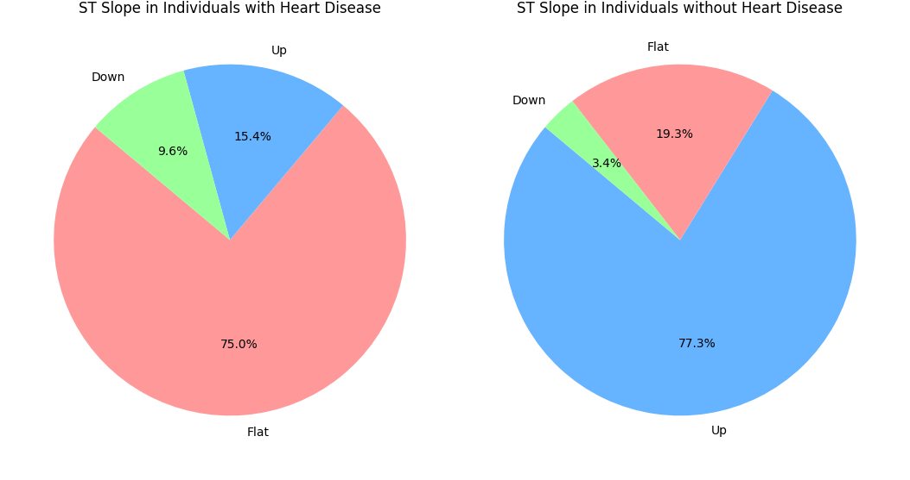

# 운동에 따른 심장질환 분석
운동을 하고 나서, 심장질환 유무에 따른 신체 영향 데이터를 분석했습니다.

## ExerciseAngina 분석

심장질환 유무에 따른 ExerciseAngina 여부입니다.  
=> ExerciseAngina는 운동 후 심장 통증입니다.
- 심장질환을 갖고 있지 않은 사람은 운동 후에도 심장 통증을 느끼지 않습니다.
- 그러나 심장질환을 갖고 있는 사람은 없는 사람에 비해 통증을 느끼는 사람이 확실히 많습니다.
- 따라서 운동 후에 심장 통증을 느낀다면, 심장 질환을 겪고 있을 가능성이 존재합니다.

## oldpeak 분석

운동 후 oldpeak에 대한 분석입니다. oldpeak가 높으면 높을수록 심장에 영향을 준다고 합니다.
- 심장질환을 갖고 있지 않은 사람은 운동 후에 oldpeak의 편차가 크지 않고, 전반적으로 수치가 낮습니다.
- 그러나 갖고 있는 사람은 oldpeak의 수치 편차가 크고, 평균적으로 큰 박스를 형성하고 있습니다.
- 따라서 oldpeak가 너무 낮거나 높은 경우에는 심장 질환을 의심할 여지가 있습니다.

## st_slope 분석

운동 후 나타나는 st_slope 분석입니다. 이 데이터는 ST 분절 기울기라고 하며, 심전도에서 심장의 전기적 활동을 나타내는 중요한 지표입니다.
- 심장 질환이 있는 사람은 운동 후에 Flat을 차지 하는 비중이 75%나 차지하고 있습니다.
- 반대로 없는 사람은 Up을 차지하는 비중에 77%를 차지하고 있습니다.
- 확실히 심장질환을 갖고 있는 사람과 없는 사람은 다른 경향을 보이고 있습니다.

## 결론
이번 시각화를 통해서 운동에 따른 심장질환 여부가 크게 갈린다는 사실을 알게 되었습니다. 나이나 성별에 따른 심장질환 여부는 운동에 비해 큰 차이가 없었지만, 운동에 따른 차이는 너무 확연한 차이를 나타낸 분석을 도출했습니다.