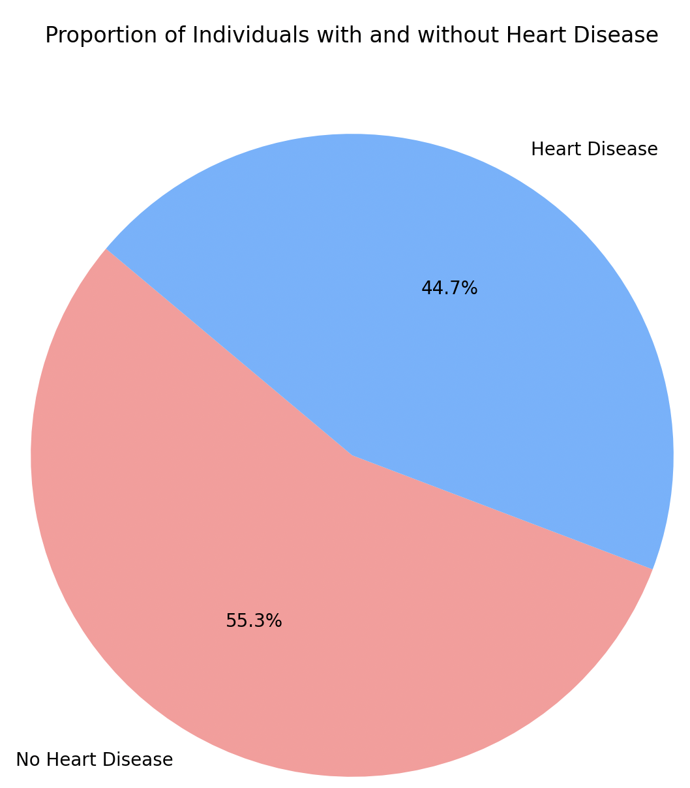
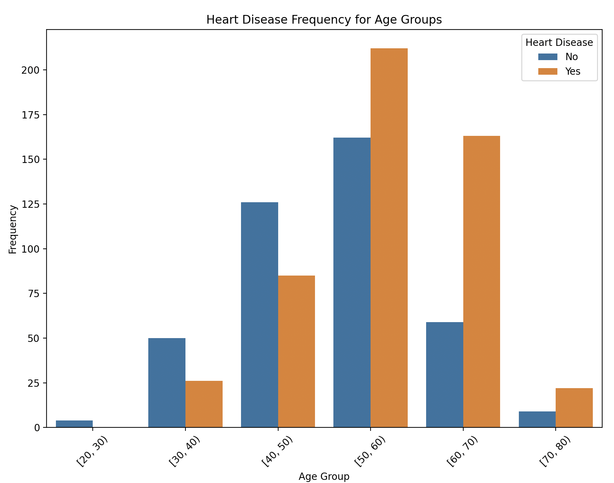
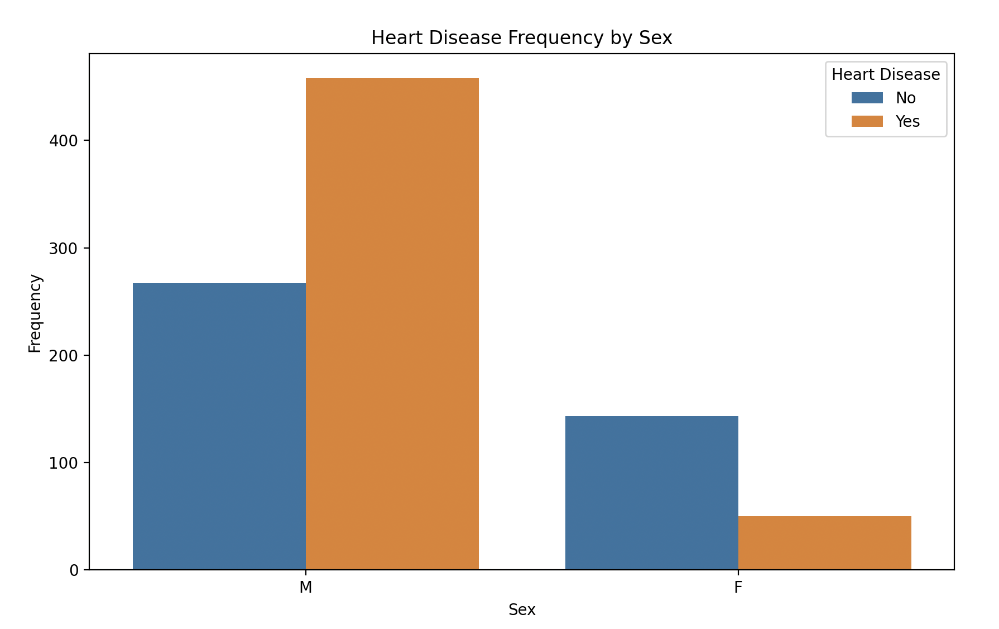
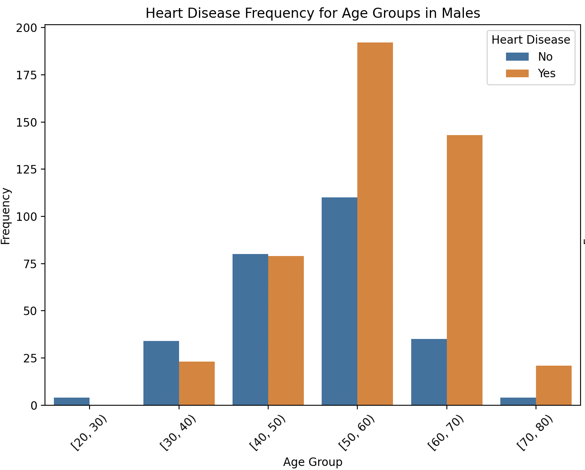
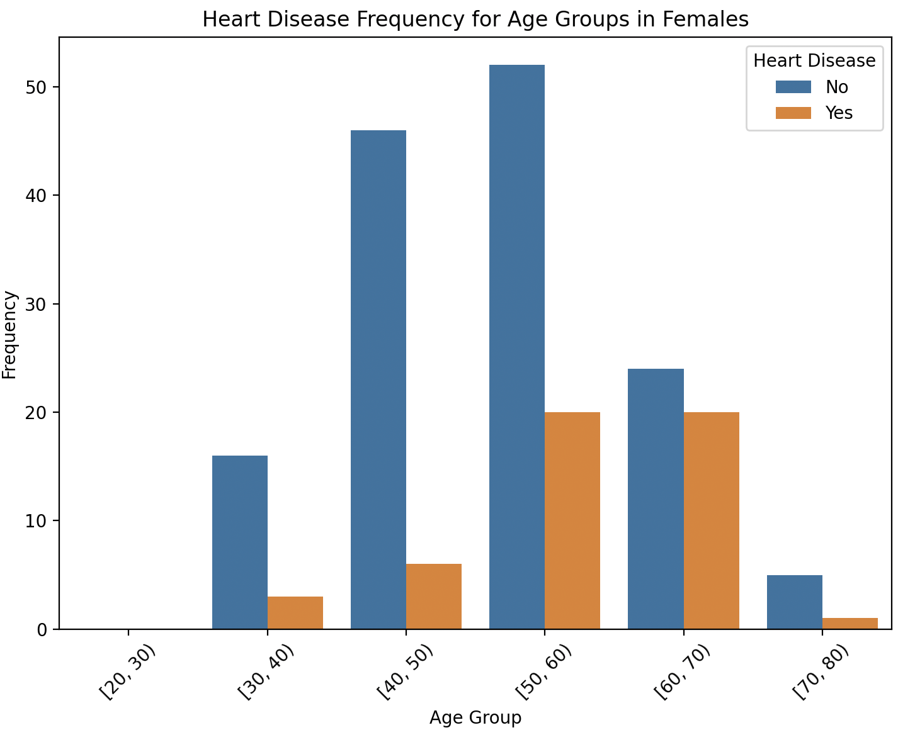

# 기본적인 심장 질환 여부 overview - 나이, 성별
- 나이에 따른 심장 질환 여부
- 성별에 따른 심장 질환 여부
를 파악합니다.

## 1. 총 심장질환 여부

기본적인 데이터를 보면 총 918 명의 사람 중에 심장 질환을 갖고 있는 사람의 비율이 약 45%를 차지하고 있습니다. 이는 약 400 명 정도가 심장 질환을 갖고 있다는 의미입니다.

## 2. 나이에 따른 심장질환 여부

나이에 따른 심장질환 여부입니다.
- 기본적으로 20대 그룹은 비교군이 적으며, 심장질환도 겪고 있지 않습니다.
- 30~40대까지는 심장질환을 갖고 있지 않은 사람의 비중이 더 많지만, 50대를 들어가고 나서부터는 심장질환을 갖고 있는 사람이 더 많아집니다.
- 특히 60대에 심장질환을 갖고 있는 비중에 두드러지게 차이가 납니다.

## 3. 성별에 따른 심장질환 여부

성별에 따른 심장질환 여부입니다.
- 여성의 경우 심장질환을 갖고 있지 않은 사람이 더 많습니다.
- 그러나 남성의 경우는 심장질환을 갖고 있는 사람이 훨씬 많습니다.

### (1) 남성의 나이별 심장질환 여부

남성의 나이별 심장질환 여부입니다.
- 40대부터 심장질환 비율이 확 좁혀지면서, 50대 이후에는 대부분의 사람이 심장질환을 겪고 있습니다.
- 특히 50대, 60대에서 비중이 압도적으로 많습니다.

### (2) 여성의 나이별 심장질환 여부

여성의 나이별 심장질환 여부입니다.
- 전체적으로 여성은 심장질환을 겪지 않는 사람이 더 많습니다.
- 여성의 경우에는 50대까지도 심장질환을 겪지 않은 사람이 더 많습니다.
- 60대에 들어서는 그 비율이 줄어들기는 하지만, 그래도 심장질환을 겪지 않는 사람이 많습니다.

## 결론
심장질환의 경우에는 남성과 여성을 따로 볼 필요가 있다는 것을 느끼는 데이터였습니다. 총 데이터의 45%가 심장질환을 겪고 있다는 초반의 분석이 있었지만, 나이 별과 성별로 나눠서 세밀하게 분석할 결과는 남성이 상당 수를 차지하고 있다는 점을 알았습니다.

그렇다면 왜 성별에 따라 이렇게 큰 차이가 나타나게 되는지 그 원인을 분석해야 합니다.