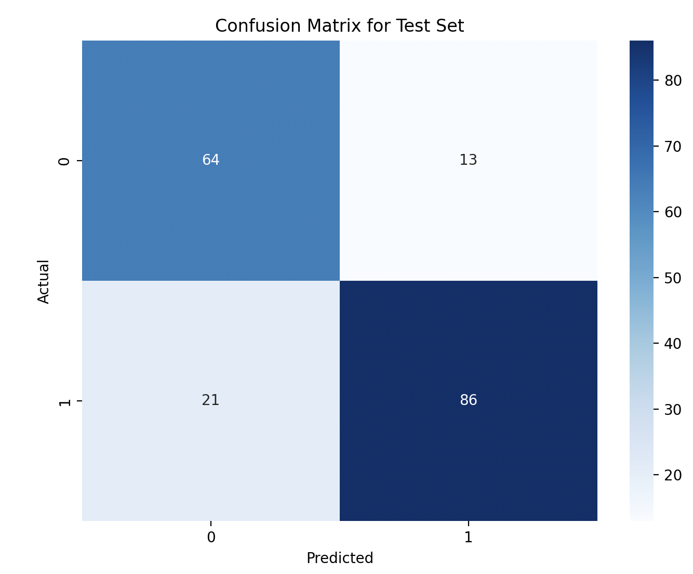
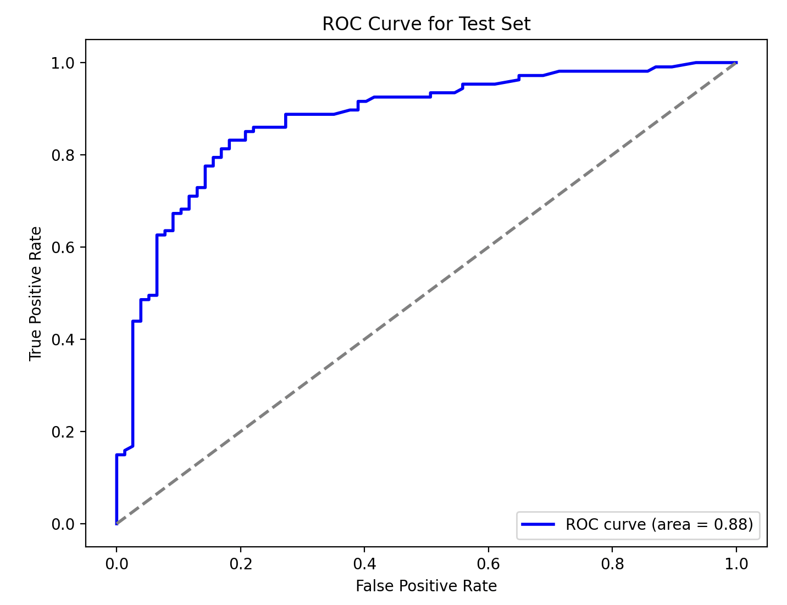
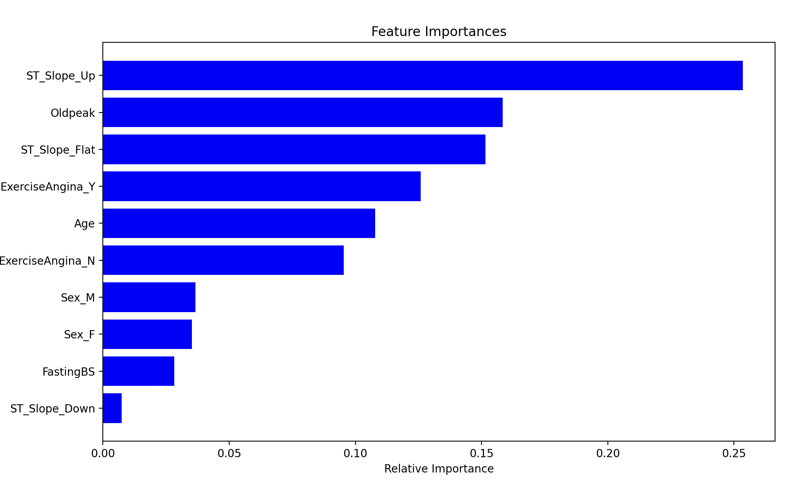

# 심장 질환 예측 모델 시각화
## 소개
이 문서는 심장 질환 예측을 위한 머신 러닝 모델의 성능을 시각화한 결과를 담고 있습니다.  
사용된 모델은 랜덤 포레스트로, 다양한 특성을 바탕으로 심장 질환의 유무를 예측합니다.

## 혼동 행렬

혼동 행렬은 모델의 성능을 직관적으로 보여줍니다. 각 행은 실제 클래스를, 각 열은 예측된 클래스를 나타냅니다. 이를 통해 모델의 정확도, 거짓 양성 및 거짓 음성의 수를 파악할 수 있습니다.
- 이 혼동 행렬은 심장 질환 예측 모델의 성능을 나타냅니다.  
=>'0' 클래스는 심장 질환이 없는 경우를, '1' 클래스는 심장 질환이 있는 경우를 의미합니다.
- 모델은 실제로 심장 질환이 없는 64개의 케이스를 정확하게 예측했으며(참 음성), 심장 질환이 있다고 잘못 예측한 경우는 13개 있습니다(거짓 양성).
- 심장 질환이 있는 107개의 케이스 중에서 모델은 86개를 정확하게 예측했습니다(참 양성), 그리고 21개를 잘못 예측하여 심장 질환이 없는 것으로 분류했습니다(거짓 음성).

## ROC 곡선 및 AUC

ROC 곡선과 AUC 점수는 모델이 양성 클래스와 음성 클래스를 얼마나 잘 구별하는지를 보여줍니다. AUC 점수가 높을수록 모델의 성능이 더 우수함을 의미합니다.
- 이 그래프의 x축은 거짓 양성 비율(FPR, False Positive Rate)을, y축은 참 양성 비율(TPR, True Positive Rate)을 나타냅니다.
- 이 곡선 아래의 면적(AUC, Area Under the Curve)은 0.88로, 모델의 성능이 상당히 좋음을 나타냅니다.
- AUC가 1에 가까울수록 모델이 완벽에 가까운 성능을 보이는 것이고, 0.5는 무작위 추측의 성능을 의미합니다.

## 특성 중요도

이 그래프는 모델 예측에 각 특성이 얼마나 영향을 미치는지 보여줍니다. 더 높은 값을 가진 특성이 모델의 예측에 더 큰 영향을 미칩니다.
- 높은 값을 가진 특성은 모델의 결정에 더 큰 영향을 미치며, 이는 해당 특성이 심장 질환 예측에 중요함을 의미합니다.
- 분석 결과, 가장 중요한 특성은 ST_Slope와 Oldpeak가 심장질환에 큰 영향을 준다는 점입니다.
- 뿐만 아니라 ExerciseAngina와 나이도 중요한 요소입니다.

## 결론
1. 모델의 성능: ROC 곡선에서 높은 AUC 값을 관찰할 수 있었으므로, 모델은 심장 질환 예측을 위한 양성 및 음성 케이스를 구분하는 데 있어서 전반적으로 좋은 성능을 보입니다.

2. 특성 중요도: 특성 중요도 그래프는 모델이 예측을 수행할 때 어떤 변수가 가장 영향력이 있는지를 보여줍니다. 이 모델에서는 ST 세그먼트의 경사와 Oldpeak가 가장 중요한 변수로 나타났으며, 이는 심전도 결과가 심장 질환 예측에 있어 매우 중요함을 나타냅니다.

3. 예측 결정 요소: 성별, 공복 혈당, 운동 유발 협심증의 유무와 같은 다른 변수들도 모델 예측에 영향을 미치나, ST 세그먼트 관련 변수들에 비해 상대적으로 중요도가 낮습니다.

4. 임상적 사용: 이 모델은 심장 질환의 위험도를 평가하는 데 사용될 수 있으며, 특히 ST 세그먼트 변화와 Oldpeak 값을 중심으로 환자의 위험도를 평가하는 데 도움이 될 수 있습니다.

5. 모델 최적화 및 검증: 모델이 실제 환자 데이터에 적용되기 전에 추가적인 검증과 최적화가 필요할 수 있습니다. 예를 들어, 교차 검증과 같은 방법을 통해 모델의 일반화 능력을 평가하고, 다양한 인구 통계학적 및 임상적 특성을 가진 데이터 세트에서 모델의 성능을 테스트해야 할 수 있습니다.

종합하자면, 이 예측 모델은 심장 질환을 진단하는 데 유용한 도구가 될 수 있으나, 실제 임상 환경에서의 사용 전에 추가적인 검증이 필요합니다. 또한, 모델이 가장 중요하게 여기는 변수들에 대한 이해를 바탕으로, 의료 전문가들은 보다 정보에 기반한 진단과 치료 계획을 수립할 수 있습니다.