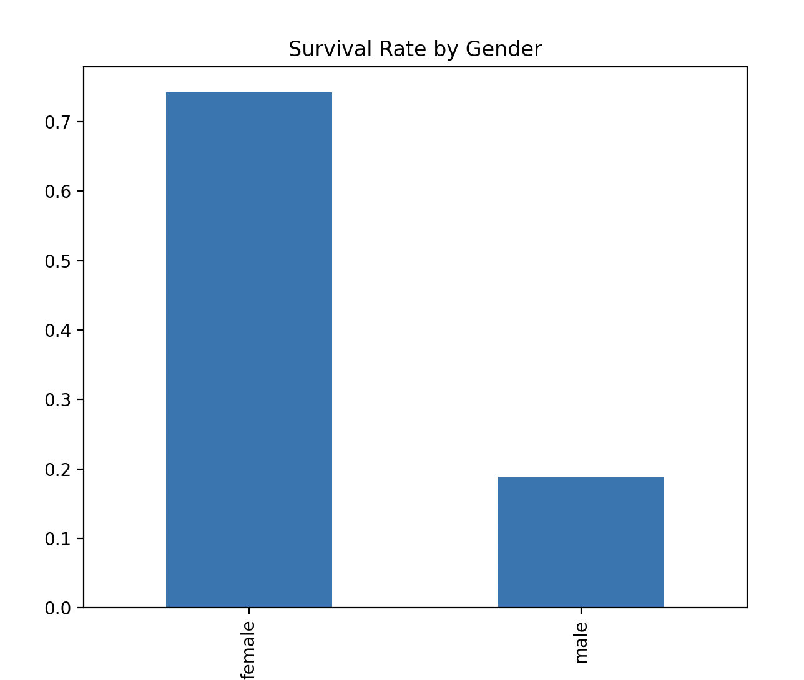
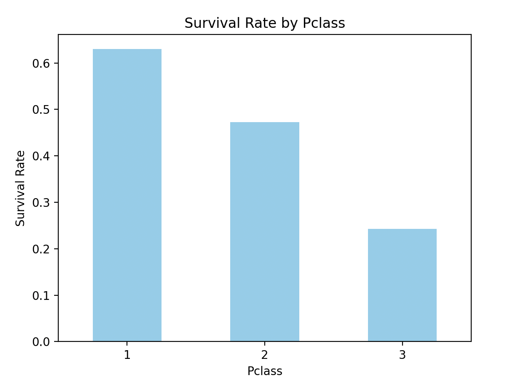
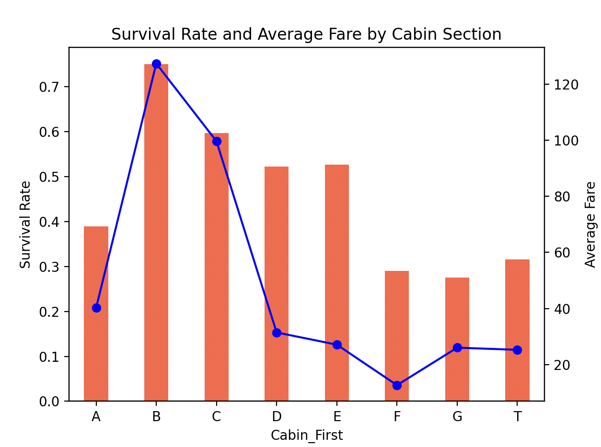

# 데이터 분석을 통한 결론 도출
- 이 문서는 타이타닉 생존자 데이터 셋을 토대로 도출한 인사이트를 기록한 문서입니다.
- 도출한 데이터를 토대로 작성한 주관적인 내용입니다.

## 기본 내용
- 생존율은 1에 가까울수록 생존 가능성이 높습니다.

## 성별에 따른 생존율

- 확실하게 여성 생존자가 많은 것을 알 수 있습니다.
- 이는 시대에 따라 여성을 우선적으로 구조했을 가능성이 있습니다.

## 등석에 따른 생존율

- 등석이 높으면 높을수록 생존율이 높은 걸 알 수 있습니다.

## 객실별 평균 요금에 따른 생존율

- 객실마다 생존율이 다르단 걸 알 수 있습니다.
- 특히 B, C 객실은 평균 가격도 높고, 생존율이 높은 걸 알 수 있습니다.
- 다만 D, E 객실은 평균 가격에 비해, 높은 생존율을 가지고 있습니다.

## 등석 및 객실별 평균 요금에 따른 생존율
.png)
- 1등석의 경우, A와 T 객실이 가격도 저렴하고 생존율도 유독 낮은 것을 확인할 수 있습니다. 이로써 같은 1등석이라 할 지라도 객실마다의 특징이 존재하고 생존율과도 연결될 수 있습니다.
- 2등석의 경우, 평균 요금대비 높은 생존율을 갖고 있습니다.
- 3등석의 경우, E객실을 제외하면 낮은 생존율을 기록하고 있습니다.

### 객실별 평균요금에 따른 생존율에 대한 인사이트
- 모든 등석이 공통적으로 가지고 있는 객실이 E 객실이며, 가격대비 가장 높은 생존율을 보여준다. 이로써 E 객실은 생존에 유리한 객실이었다는 것을 알 수 있다.
